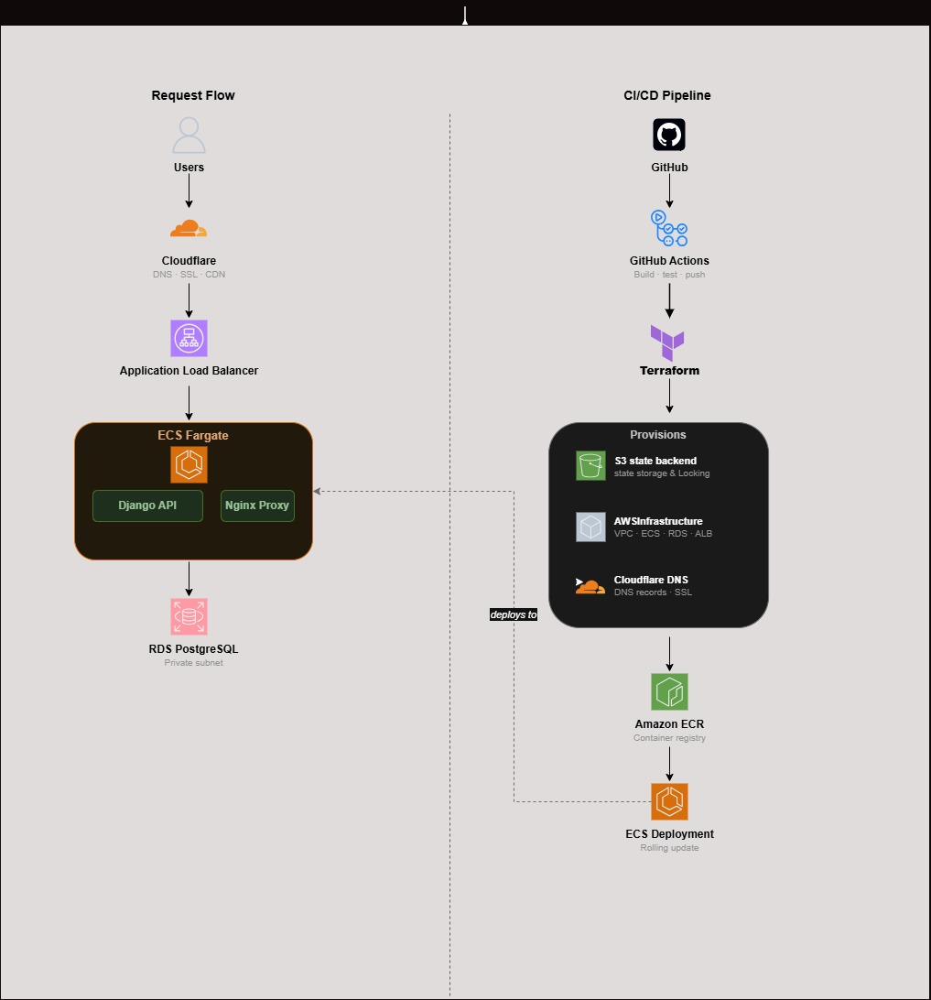
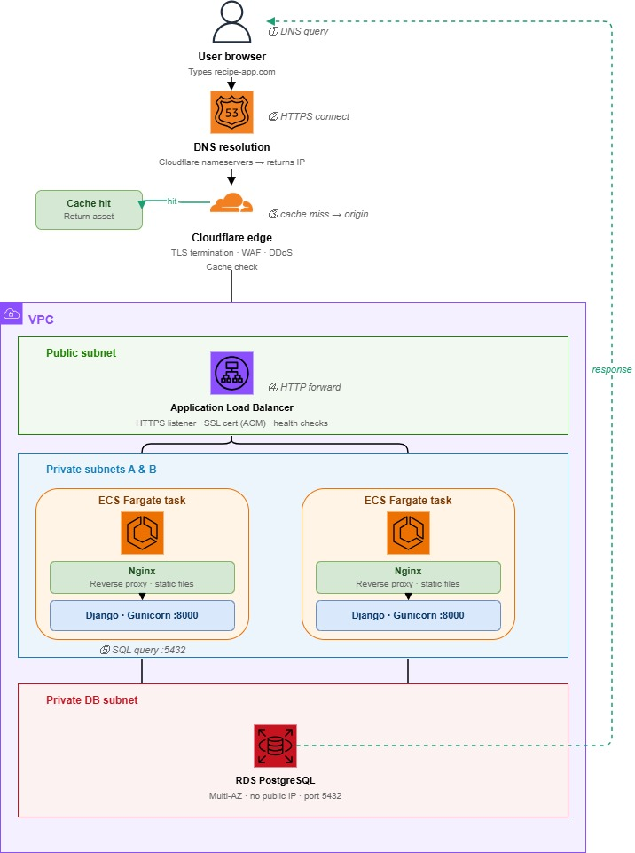

# Django Recipe API on AWS ECS Fargate

Production-style deployment of a Django REST API using AWS ECS Fargate, Terraform, GitHub Actions, Amazon RDS PostgreSQL, and Cloudflare.



## Overview

This project demonstrates the deployment of a containerized Django REST API on AWS using modern DevOps and Cloud Engineering practices.

The infrastructure is provisioned through Terraform, application deployments are automated through GitHub Actions, and traffic is routed through Cloudflare and an AWS Application Load Balancer into ECS Fargate services running in private subnets.

The project was designed with three goals:

- Learn Infrastructure as Code
- Implement automated CI/CD pipelines
- Build a cost-efficient cloud environment suitable for hosting multiple future projects

## Design Decisions

### Why ECS Fargate?

I wanted container orchestration without managing EC2 instances.

### Why Terraform?

Infrastructure was managed through Terraform to ensure all cloud resources could be version-controlled, reviewed, and reproduced consistently across environments. This approach reduces configuration drift and enables repeatable deployments through automated CI/CD pipelines.

### Why Cloudflare instead of Route53 + CloudFront?

The primary motivation was cost efficiency and ownership of a custom domain for a personal portfolio platform.

Cloudflare provides:

DNS management
SSL/TLS certificates
CDN capabilities
DDoS protection

without requiring multiple AWS services or additional operational costs. The domain also serves as a foundation for hosting future projects under dedicated subdomains.

Why Automate DNS Management with Terraform?

Application Load Balancers receive dynamically generated DNS endpoints whenever infrastructure is recreated.

Without automation, each deployment would require manually updating Cloudflare DNS records.

To eliminate this operational overhead, the Cloudflare Terraform provider retrieves the newly created ALB endpoint and automatically updates the corresponding CNAME record during deployment.

Benefits

No manual DNS updates
Infrastructure remains fully reproducible
Faster recovery after complete infrastructure rebuilds
DNS configuration managed as code

## Network Architecture



Request Flow:

1. User sends HTTPS request
2. Cloudflare handles DNS resolution and SSL
3. Traffic reaches the AWS Application Load Balancer
4. ALB forwards requests to ECS Fargate tasks
5. Nginx proxies requests to Django
6. Django communicates with PostgreSQL hosted on Amazon RDS

## Infrastructure

| Component | Purpose |
|------------|------------|
| ECS Fargate | Container execution |
| ECR | Container registry |
| RDS PostgreSQL | Persistent data storage |
| ALB | Traffic distribution |
| Terraform | Infrastructure as Code |
| GitHub Actions | CI/CD |
| Cloudflare | DNS, SSL, CDN |

## Challenges & Lessons Learned

Challenge 1: Static Assets Returning 404 Errors

Problem

After deploying the application to ECS Fargate, the Django Admin interface and frontend loaded as unstyled HTML. Browser developer tools showed repeated 404 Not Found errors for CSS and JavaScript assets.

Root Cause

The Nginx configuration used the root directive inside the /static/ location block:
```
location /static/ {
    root /vol/web/static;
} 
```
When a request such as:
```
/static/admin/css/base.css
} 
```
arrived, Nginx appended the entire request URI to the configured path, resulting in:
```
/vol/web/static/static/admin/css/base.css
```
Because the duplicated /static/ directory did not exist, Nginx could not locate the requested files and returned 404 responses.

Resolution

The configuration was updated to use the alias directive instead:
```
location /static/ {
    alias /vol/web/static/;
}
```
Unlike root, the alias directive replaces the matching URI prefix rather than appending it, allowing requests to resolve correctly to the collected Django static assets.

Outcome

Static assets were served successfully, restoring application styling and functionality. This issue reinforced the importance of understanding the behavioral differences between Nginx root and alias directives when serving static content.

Challenge 2: CSRF Verification Failures Behind Cloudflare

Problem

After configuring a custom domain through Cloudflare, authenticated requests submitted through the Django Admin interface consistently failed with:
```
403 Forbidden
CSRF verification failed
```
Root Cause

Cloudflare was initially configured in Flexible SSL mode. While client traffic reached Cloudflare over HTTPS, requests were forwarded to the AWS Application Load Balancer over HTTP. Because the application was operating behind multiple proxy layers:
```
User
↓
Cloudflare
↓
Application Load Balancer
↓
Nginx
↓
Django
```
Django could not correctly determine the original request protocol and rejected form submissions during CSRF validation.

Resolution

The Cloudflare SSL configuration was upgraded to Full SSL to ensure encrypted communication between Cloudflare and the Application Load Balancer. Additionally:

Nginx was configured to forward the X-Forwarded-Proto header.
Django was configured to trust forwarded HTTPS headers.
The application domain was added to CSRF_TRUSTED_ORIGINS.
```
SECURE_PROXY_SSL_HEADER = ("HTTP_X_FORWARDED_PROTO", "https")

CSRF_TRUSTED_ORIGINS = [
    "https://david-cloud.site",
    "https://*.david-cloud.site",
]
```
Challenge 3: Terraform vs AWS Service-Linked Roles

Problem

Terraform deployments and infrastructure destruction intermittently failed when managing the ECS service-linked IAM role.

During infrastructure destruction:
```
AccessDenied: iam:DeleteServiceLinkedRole
```
During subsequent deployments:
```
Service role name AWSServiceRoleForECS has been taken in this account
```
Root Cause

The project initially attempted to manage the ECS service-linked role through Terraform:
```
resource "aws_iam_service_linked_role" "ecs" {
  aws_service_name = "ecs.amazonaws.com"
}
```
However, AWSServiceRoleForECS is an AWS-managed service-linked role that is automatically created when ECS is first used within an account.

This resulted in two issues:

The CI/CD IAM user lacked permissions to delete service-linked roles.
AWS had already created the role, preventing Terraform from recreating it.

The underlying problem was treating an AWS-managed resource as user-managed infrastructure.

Resolution

The ECS service-linked role was removed entirely from Terraform management:

Removed the aws_iam_service_linked_role resource.
Removed all depends_on references targeting the role.
Allowed AWS to provision and manage the role automatically.

Outcome

Infrastructure deployments and destruction completed successfully without IAM conflicts. This reinforced an important Infrastructure as Code principle:

Not every cloud resource should be managed by Terraform. AWS-managed service-linked roles should generally be treated as provider-owned resources rather than application infrastructure.

## Future Improvements

Planned enhancements:

- Replace ECS rolling deployments with blue/green deployments
- Add CloudWatch dashboards and alarms
- Introduce centralized logging
- Add ECS autoscaling policies
- Implement automated backup verification
- Expand infrastructure to support multiple applications under subdomains

## Skills Demonstrated

- AWS ECS Fargate
- Amazon RDS PostgreSQL
- Terraform
- Docker
- GitHub Actions
- Cloudflare
- Infrastructure as Code
- CI/CD
- Reverse Proxy Configuration
- Linux
- Networking
- SSL/TLS
